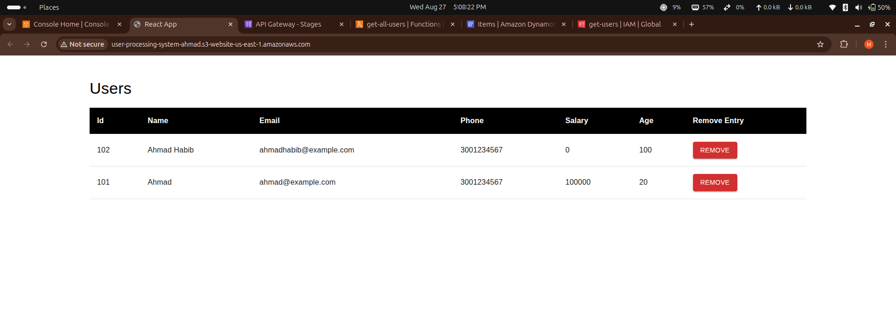

# Deploy React App with AWS S3, DynamoDB, and Lambda

This guide explains how to deploy a React app using **S3 for hosting**, **DynamoDB for database**, and **Lambda + API Gateway for backend API**.

---

## 1. Clone Project
```bash
git clone <this-repo-url>
cd <project-folder>
````

---

## 2. Run Project Locally

```bash
npm install
npm start
```

Verify it runs successfully at `http://localhost:3000`.

---

## 3. Create S3 Bucket

1. Go to **AWS Console → S3 → Create Bucket**
2. Enter a **unique bucket name**
3. Unselect **Block all public access**
4. Select **I acknowledge...** warning
5. Click **Create bucket**

---

## 4. Enable Static Website Hosting

1. Open your bucket
2. Go to **Properties**
3. Scroll to **Static website hosting** → **Enable**
4. Enter:

   * **Index document**: `index.html`
5. Save changes

---

## 5. Upload Build to S3

Build the React project:

```bash
npm run build
```

Sync build folder to S3:
    . make sure your terminal is at your current folder path 

```bash
aws s3 sync build/ s3://<your-bucket-name>
```

---

## 6. Create DynamoDB Table

1. Go to **AWS Console → DynamoDB → Create table**

2. Enter:

   * Table name: `yourtable`
   * Partition key: `id` (Number)

3. After table creation → click **Create item** and paste:

```json
{
  "id": { "N": "102" },
  "age": { "N": "100" },
  "email": { "S": "yourname@example.com" },
  "name": { "S": "My Name" },
  "phone": { "N": "03001234567" },
  "salary": { "N": "0" }
}
```

---

## 7. Create AWS Lambda Function

1. Go to **AWS Console → Lambda → Create Function**

2. Select:

   * Runtime: **Node.js**
   * Function name: `GetUsers`

3. Paste code:

```js
import { DynamoDBClient } from "@aws-sdk/client-dynamodb";
import { ScanCommand, DynamoDBDocumentClient } from "@aws-sdk/lib-dynamodb";

const client = new DynamoDBClient({ region: "us-east-1" });
const docClient = DynamoDBDocumentClient.from(client);

const params = {
    TableName: "yourtable"
};

async function getDynamoDBItem() {
    try {
        const data = await docClient.send(new ScanCommand(params));
        return data;
    } catch (error) {
        console.log(error);
        return error;
    }
}

export const handler = async (event, context) => {
    try {
        const data = await getDynamoDBItem();
        return { body: JSON.stringify(data) };
    } catch (error) {
        console.log(error);
        return error;
    }
};
```

4. **Deploy** and **Test** the function.

---

## 8. Add API Gateway

1. Go to **API Gateway → Create API**
2. Create **Resource** and add **Method → GET**
3. Attach your lambda function to api gateway.  
3. Enable **CORS**
4. **Deploy API** → create a new stage
5. Copy the **Invoke URL**

---

## 9. Update React Code

In your React project, update `src/component/user` with the `API_URL` from API Gateway.

---

## 10. Re-Deploy React Build

```bash
npm run build
aws s3 sync build/ s3://<your-bucket-name>
```

---

## 11. Access Your Deployed App

1. Go to **S3 → Your Bucket → Properties**
2. Scroll to **Static website hosting**
3. Copy the **Bucket website endpoint**
4. Open it in your browser 🎉


## 🌐 Live Demo

You can check out the live app (hosted on AWS Free Tier) before it expires:

[Live Demo](http://user-processing-system-ahmad.s3-website-us-east-1.amazonaws.com/)

